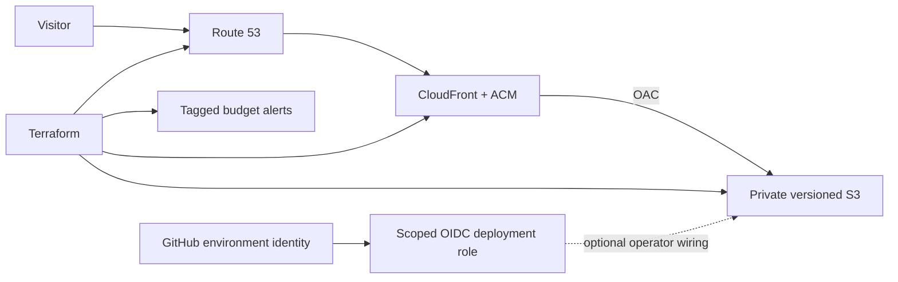

# Proairesis infrastructure portfolio

Reusable AWS infrastructure extracted from my Proairesis project, with production identifiers and application code removed. This is a small code portfolio, not the production repository or a managed service.

**Source-available for noncommercial use only.** See [LICENSE.md](LICENSE.md) and [NOTICE](NOTICE). Commercial use requires separate permission from Junyi Men. This is not an open-source licence.

## Start with these files

| Example | What to look for |
| --- | --- |
| [Static-site module](infra/modules/static_site/main.tf) | Private, versioned S3; CloudFront OAC; ACM; Route 53; HTTPS and security headers |
| [Budget module](infra/modules/budget/main.tf) | Actual/forecast alerts and environment cost-allocation tags |
| [OIDC role module](infra/modules/github_oidc/main.tf) | Exact repository/environment trust; scoped S3 and CloudFront permissions; no static AWS credentials |
| [Artifact integrity example](scripts/artifact.mjs) | Source-bound SHA-256 manifests and staging-receipt checks before promotion |
| [Validation workflow](.github/workflows/validate.yml) | Pinned actions; formatting, validation, mock-provider tests and Node tests without cloud credentials |

## Architecture



## Provenance and boundaries

The static-site and budget modules are extracted from the Proairesis infrastructure. The OIDC module adapts its deployment-role pattern by replacing hard-coded production targets with inputs. The small release-integrity example and mock tests were written for this portfolio to illustrate the production pattern; they are not the full production deployment engine.

Prepared by Junyi Men with AI assistance; I am responsible for reviewing and explaining the implementation. No employer/client code, Manettas material, product screenshots, admin application, customer records, secret values, state, plans or original Git history is included. This repository demonstrates AWS IaC and release-safety practices, not GPU cluster operations, multi-cloud orchestration or measured cost savings.

## Validate locally

Requirements: Node.js 22+ and Terraform 1.11.4 (the version used in CI). Provider downloads require network access; validation and mocked tests do not need AWS credentials.

```sh
npm test
terraform fmt -check -recursive infra
for root in infra/examples/site infra/examples/oidc; do
  terraform -chdir="$root" init -backend=false -input=false -lockfile=readonly
  terraform -chdir="$root" validate
  terraform -chdir="$root" test
done
```

The Terraform tests use mock providers and plan-only runs, not AWS. The example SHA-256 receipt demonstrates integrity, not independent cryptographic attestation: a real release system must also verify workflow provenance and control who can write evidence.

## Optional noncommercial deployment

CI never runs a real plan/apply, obtains cloud credentials, deploys a site or changes DNS. To experiment in your own AWS account:

1. Review the licence and costs first. Use a dedicated sandbox and temporary credentials.
2. Own a domain and an existing authoritative public Route 53 hosted zone. The `example.com` values are placeholders and cannot be used to provision a real site.
3. Copy `infra/examples/site/terraform.tfvars.example` to ignored `terraform.tfvars`, then provide your own hostname, zone and alert recipient. Never commit credentials or generated state/plan files.
4. Configure a protected, encrypted remote backend with locking before shared/production use. The small example deliberately uses local state; use separate state and input configurations for staging and production.
5. Review `terraform plan` before any deliberate `terraform apply`. Applying provisions billable resources and changes records in your chosen zone. No DNS-zone or registrar migration is automated.
6. Upload your own static artifact and include `index.html` and `404.html`. This repo contains infrastructure, not a website build.
7. For optional CI deployment, provision/import your GitHub OIDC provider, configure protected GitHub environments, and supply the exact subject claim and resource ARNs to `infra/examples/oidc`. Confirm the subject against your GitHub configuration rather than copying a production trust string.

Budget alerts are not spending caps. Activate the Environment cost-allocation tag before relying on its filter and use an account-wide budget as a fallback. The default CloudFront price class prioritises cost over worldwide edge coverage; choose a class suitable for your users. ACM certificates for CloudFront use us-east-1; other regional defaults use Sydney.

S3 `force_destroy = false` helps prevent accidental deletion of a nonempty bucket. Teardown needs an explicit retention/deletion decision for every object version; never assume `terraform destroy` is a cost-free or safe cleanup shortcut. Empty buckets and other resources can still be destroyed. Data-retention and recovery requirements belong in the operator's runbook.

## Limitations

- No live AWS deployment has been performed for this extracted repository.
- No AWS account, role, secret, production endpoint or GitHub deployment environment is preconfigured here.
- The optional API-origin inputs retained in the static-site module default to empty; API services themselves are not included.
- Logging, WAF, alarms, remote-state bootstrap and drift detection are not included in this minimal extract.
- Mock tests do not establish real IAM access, DNS delegation, TLS issuance or end-to-end deployment success.
- Third-party tools/providers/GitHub actions retain their own licences. The licence here covers the project code, not those dependencies or trademarks.

## Licence

[PolyForm Noncommercial 1.0.0](https://polyformproject.org/licenses/noncommercial/1.0.0) applies. Read its full permitted-purpose definitions, including its treatment of noncommercial organisations. No commercial licence is granted by this repository. Contact the repository owner for separate commercial permission.
